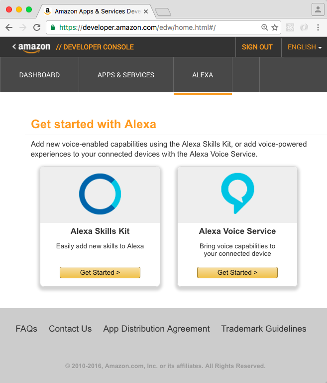
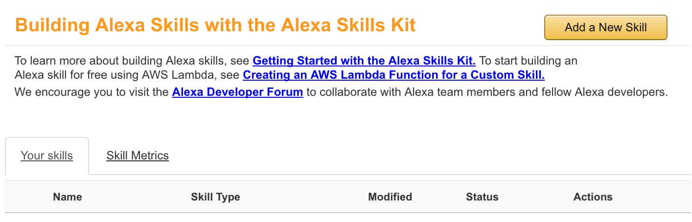
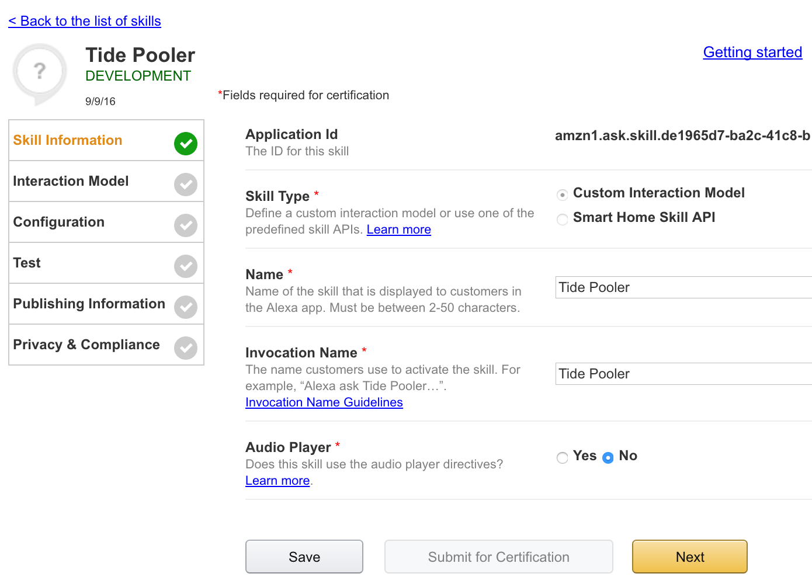

# Prerequisites

* Install Node.js and update npm (v. 5 or later) using these instructions: https://docs.npmjs.com/getting-started/installing-node

* You will need an AWS account; the [free tier](https://aws.amazon.com/free/) is sufficient for this lesson.

* You will also need to register as a developer in [Amazon's developer portal](https://developer.amazon.com/).

## Setting up your skill

With all the prerequisites in place, you're ready to define your skill. There are several steps in this process. First, log into the [Amazon Developer Portal](https://developer.amazon.com), and then click the Alexa link at the top of the page. You'll be prompted to choose a starting point (Alexa Skills Kit or Alexa Voice Service). Click Get Started under the Alexa Skills Kit option:




<!-- https://developer.amazon.com/alexa takes me to a landing page where I need to sign in, and I still need to click the Alexa link. https://developer.amazon.com/edw/home.html is a direct link that works, but with a name like /edw, I'm not sure if that URL is a reliable permalink. -->

### Step 1: Add the New Skill

* Click the Add a New Skill button



* Set the following options:
  * Skill type: Make sure this is set to Custom Interaction Model.
  * Name: This is what appears in the Alexa app. Call it "Tide Pooler."
  * Invocation Name: This is how users will activate the skill. Use "Tide Pooler" here as well.
  * Audio Player: You can leave this set to No for this skill. If you were playing audio, such a music, that you wanted to allow users to stop or pause, you'd need this. You won't need it here.
* Click Next.



### Step 2: Define the Skill's Interaction Model

The interaction model determines...

# Getting started

* Clone this repository
* run `npm install`

# Setting up your keys

Create a file called `.env` to store all the various keys you'll need, like this:

```
AWS_KEY=<your aws key>
APP_ID=<your app id>
```

In your program, you'll refer to these as `process.env.AWS_KEY`, `process.env.APP_ID`, etc.  

Note that we add the `.env` to `.gitignore` so that you don't accidentally check your keys into your github repo, which would be bad!
